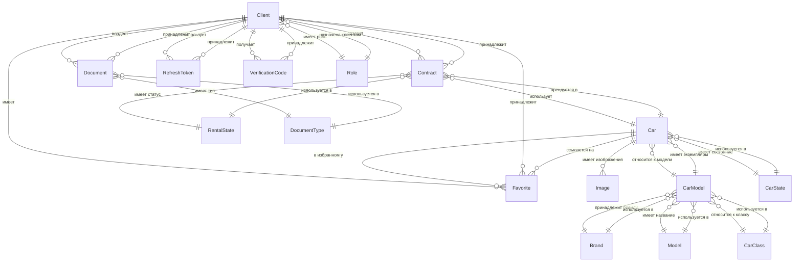

# Анализ зависимостей между сущностями

**Дата анализа**: 2025-12-04  
**Проект**: Car Sharing Backend  
**Общее количество сущностей**: 16

---

## 📊 Граф зависимостей (Mermaid)



---

## 🏗️ Структура зависимостей

### 1️⃣ **RENTAL CONTEXT (Контекст аренды)** 🔴 CORE

#### Aggregate Root: **Contract**
- **Зависимости**:
  - `Client` (ManyToOne) - клиент, создавший договор
  - `Car` (ManyToOne) - арендуемый автомобиль
  - `RentalState` (ManyToOne) - статус договора
  - `Money` (Embedded) - стоимость аренды

**Проблемы**:
- ❌ Прямая зависимость от агрегата `Client` - нарушение DDD
- ❌ Прямая зависимость от агрегата `Car` - нарушение DDD
- ❌ Отсутствие бизнес-методов (анемичная модель)

**Рекомендации**:
- ✅ Заменить на `ClientId` и `CarId` (Value Objects)
- ✅ Добавить методы: `confirm()`, `cancel()`, `complete()`, `updatePeriod()`
- ✅ Инкапсулировать инварианты (проверка дат, статусов)

---

### 2️⃣ **FLEET CONTEXT (Контекст автопарка)** 🔵

#### Aggregate Root: **Car**
- **Зависимости**:
  - `CarModel` (ManyToOne) - модель автомобиля
  - `CarState` (ManyToOne) - состояние (доступен/недоступен)
  - `Money` (Embedded) - дневная ставка аренды
  - `Contract` (OneToMany) - история аренд ⚠️
  - `Favorite` (OneToMany) - избранное ⚠️
  - `Image` (OneToMany, cascade) - изображения ✅

**Проблемы**:
- ❌ Двунаправленные связи `contracts` и `favorites` - утечка агрегата
- ❌ `CarModel` содержит слишком много информации (Brand, Model, CarClass)
- ❌ `gosNumber` и `vin` должны быть Value Objects с валидацией

**Рекомендации**:
- ✅ Удалить `@OneToMany` связи (contracts, favorites) - нарушают границы агрегата
- ✅ Создать Value Objects: `VIN`, `GosNumber`
- ✅ Сохранить `@OneToMany` для `Image` - это часть агрегата
- ✅ Разделить `CarModel` на отдельные сущности

---

#### Entity: **CarModel** (часть агрегата Car)
- **Зависимости**:
  - `Brand` (ManyToOne) - бренд автомобиля
  - `Model` (ManyToOne) - название модели
  - `CarClass` (ManyToOne) - класс автомобиля
  - `Car` (OneToMany) - экземпляры автомобилей ⚠️

**Проблемы**:
- ❌ Смешение концептов - "модель" объединяет бренд, название, класс, тип кузова
- ❌ Двунаправленная связь с `Car`
- ❌ TODO в коде: "отделить брэнд и модель"

**Рекомендации**:
- ✅ Разделить на отдельные Value Objects или справочники:
  - `BrandId` - ссылка на бренд
  - `ModelNameId` - ссылка на название модели
  - `CarClassId` - ссылка на класс
  - `BodyType` - enum для типа кузова
- ✅ Удалить `@OneToMany` связь с `Car`

---

#### Справочники Fleet Context:
- **Brand** (справочник брендов) - простая сущность
- **Model** (справочник названий моделей) - простая сущность
- **CarClass** (справочник классов) - простая сущность
- **CarState** (справочник состояний) - можно превратить в Value Object/Enum

---

### 3️⃣ **CLIENT CONTEXT (Контекст клиентов)** 🟢

#### Aggregate Root: **Client**
- **Зависимости**:
  - `Role` (ManyToOne) - роль пользователя
  - `Contract` (OneToMany) - история договоров ⚠️
  - `Favorite` (OneToMany) - избранные автомобили ⚠️
  - `Document` (через обратную связь) - документы клиента
  - `RefreshToken` (через обратную связь) - токены
  - `VerificationCode` (через обратную связь) - коды верификации

**Проблемы**:
- ❌ Двунаправленные связи с `Contract` и `Favorite` - нарушение границ
- ❌ `email`, `phone`, `login` - примитивы вместо Value Objects
- ❌ Флаги `deleted`, `banned`, `emailVerified` - должны быть частью статуса
- ❌ TODO: закомментированные поля

**Рекомендации**:
- ✅ Удалить `@OneToMany` связи (contracts, favorites)
- ✅ Создать Value Objects: `Email`, `Phone`, `Login`
- ✅ Создать `ClientStatus` (enum: ACTIVE, BANNED, DELETED, PENDING_VERIFICATION)
- ✅ Методы: `ban()`, `unban()`, `verifyEmail()`, `delete()`

---

#### Entity: **Document** (часть агрегата Client)
- **Зависимости**:
  - `Client` (ManyToOne) - владелец документа
  - `DocumentType` (ManyToOne) - тип документа

**Проблемы**:
- ❌ Прямая связь с `Client` - может быть, но требует проверки границ
- ❌ `verified` и `deleted` - должны быть в статусе

**Рекомендации**:
- ✅ Возможно, `Document` - отдельный агрегат с `ClientId`
- ✅ Создать `DocumentStatus` (PENDING, VERIFIED, REJECTED, DELETED)
- ✅ Добавить методы: `verify()`, `reject()`, `delete()`

---

#### Entity: **Favorite** (связь M:N)
- **Зависимости**:
  - `Client` (ManyToOne)
  - `Car` (ManyToOne)

**Проблемы**:
- ❌ Связывает два агрегата напрямую
- ❌ Непонятно, к какому агрегату относится

**Рекомендации**:
- ✅ Возможно, `Favorite` - отдельный агрегат или часть `Client`
- ✅ Использовать `ClientId` и `CarId` вместо прямых ссылок
- ✅ Можно переместить в Client Context: `Client.addToFavorites(CarId)`

---

#### Справочники Client Context:
- **Role** - справочник ролей
- **DocumentType** - справочник типов документов

---

### 4️⃣ **IDENTITY CONTEXT (Контекст идентификации)** 🟡

#### Entity: **RefreshToken**
- **Зависимости**:
  - `Client` (ManyToOne) - владелец токена

**Проблемы**:
- ❌ Прямая зависимость от `Client` из другого контекста

**Рекомендации**:
- ✅ Использовать `ClientId` вместо `Client`
- ✅ Методы: `revoke()`, `isExpired()`, `isValid()`

---

#### Entity: **VerificationCode**
- **Зависимости**:
  - `Client` (ManyToOne) - владелец кода
  - `VerificationCodeType` (Enum) - тип кода ✅

**Проблемы**:
- ❌ Прямая зависимость от `Client`

**Рекомендации**:
- ✅ Использовать `ClientId`
- ✅ Добавить методы: `isExpired()`, `verify()`, `use()`

---

## 📈 Матрица зависимостей

| Сущность | Зависит от | Используется в | Тип связи | Проблема |
|----------|-----------|----------------|-----------|----------|
| **Contract** | Client, Car, RentalState, Money | - | ManyToOne | ❌ Прямые ссылки на агрегаты |
| **Car** | CarModel, CarState, Money | Contract, Favorite, Image | ManyToOne + OneToMany | ❌ Двунаправленные связи |
| **Client** | Role | Contract, Favorite, Document, RefreshToken, VerificationCode | ManyToOne + OneToMany | ❌ Двунаправленные связи |
| **CarModel** | Brand, Model, CarClass | Car | ManyToOne + OneToMany | ❌ Смешение концептов |
| **Document** | Client, DocumentType | - | ManyToOne | ⚠️ Граница агрегата |
| **Favorite** | Client, Car | - | ManyToOne | ❌ Связывает агрегаты |
| **Image** | Car | - | ManyToOne | ✅ Часть агрегата |
| **RefreshToken** | Client | - | ManyToOne | ❌ Связь между контекстами |
| **VerificationCode** | Client | - | ManyToOne | ❌ Связь между контекстами |
| **Brand** | - | CarModel | OneToMany | ✅ Справочник |
| **Model** | - | CarModel | OneToMany | ✅ Справочник |
| **CarClass** | - | CarModel | OneToMany | ✅ Справочник |
| **CarState** | - | Car | OneToMany | ✅ Справочник |
| **RentalState** | - | Contract | OneToMany | ✅ Справочник |
| **Role** | - | Client | OneToMany | ✅ Справочник |
| **DocumentType** | - | Document | OneToMany | ✅ Справочник |

---

## 🔴 Критичные проблемы

### 1. **Нарушение границ агрегатов**
**Проблема**: Агрегаты напрямую ссылаются друг на друга через `@ManyToOne`

**Примеры**:
```java
// Contract.java
@ManyToOne
private Client client;  // ❌ Прямая ссылка на агрегат

@ManyToOne
private Car car;  // ❌ Прямая ссылка на агрегат
```

**Решение**:
```java
// Contract.java (DDD)
private ClientId clientId;  // ✅ Только ID
private CarId carId;        // ✅ Только ID
```

---

### 2. **Двунаправленные связи**
**Проблема**: `@OneToMany` создаёт утечку агрегата и сложность в управлении

**Примеры**:
```java
// Car.java
@OneToMany(mappedBy = "car")
private List<Contract> contracts;  // ❌ Не нужно для агрегата

// Client.java
@OneToMany(mappedBy = "client")
private List<Contract> contracts;  // ❌ Не нужно для агрегата
```

**Решение**: Удалить `@OneToMany`, запрашивать через Repository:
```java
// Вместо car.getContracts()
List<Contract> contracts = contractRepository.findByCarId(car.getId());
```

---

### 3. **Примитивная одержимость**
**Проблема**: Важные концепты представлены примитивами

**Примеры**:
```java
// Car.java
private String gosNumber;  // ❌ Должен быть GosNumber
private String vin;        // ❌ Должен быть VIN

// Client.java
private String email;      // ❌ Должен быть Email
private String phone;      // ❌ Должен быть Phone
```

**Решение**: Value Objects с валидацией
```java
public record VIN(String value) {
    public VIN {
        if (value == null || !value.matches("^[A-HJ-NPR-Z0-9]{17}$")) {
            throw new InvalidVINException(value);
        }
    }
}
```

---

### 4. **Анемичная модель**
**Проблема**: Сущности не содержат бизнес-логики

**Примеры**:
```java
// Contract.java
@Setter  // ❌ Публичные сеттеры
private RentalState state;
```

**Решение**: Бизнес-методы
```java
// Contract.java (DDD)
public void confirm() {
    if (!canBeConfirmed()) {
        throw new InvalidStateTransitionException();
    }
    this.state = RentalState.CONFIRMED;
}
```

---

## 📊 Статистика зависимостей

| Метрика | Значение | Оценка |
|---------|----------|--------|
| Общее количество сущностей | 16 | 🟡 |
| Агрегаты (потенциальные) | 3 (Contract, Car, Client) | ✅ |
| Справочники | 7 | ✅ |
| Прямые связи между агрегатами | 4 (Contract↔Client, Contract↔Car, Favorite↔Client, Favorite↔Car) | ❌ |
| Двунаправленные связи | 8 | ❌ |
| Value Objects | 1 (Money) | ❌ Мало |
| Сущностей с `@Setter` | 5 | ❌ |

---

## 🎯 Рекомендации по рефакторингу

### Приоритет 1 (Критично)
1. ✅ **Удалить прямые связи между агрегатами** - заменить на ID
2. ✅ **Удалить двунаправленные связи** - оставить только ManyToOne в JPA entities
3. ✅ **Создать Value Objects** - VIN, GosNumber, Email, Phone, RentalPeriod

### Приоритет 2 (Важно)
4. ✅ **Добавить бизнес-методы** - убрать сеттеры из агрегатов
5. ✅ **Разделить CarModel** - выделить отдельные справочники
6. ✅ **Определить границы Document и Favorite** - часть агрегата или отдельный?

### Приоритет 3 (Желательно)
7. ✅ **Создать статусы** - ClientStatus, DocumentStatus вместо флагов
8. ✅ **Добавить Domain Events** - для коммуникации между BC
9. ✅ **Применить Specification Pattern** - для сложных фильтров

---

## 📐 Целевая архитектура агрегатов

### После рефакторинга:

```
RENTAL CONTEXT:
  Contract (Aggregate Root)
    ├─ ContractId (Identity)
    ├─ ClientId (Reference)
    ├─ CarId (Reference)
    ├─ RentalPeriod (Value Object)
    ├─ Money (Value Object)
    └─ RentalState (Value Object/Enum)

FLEET CONTEXT:
  Car (Aggregate Root)
    ├─ CarId (Identity)
    ├─ VIN (Value Object)
    ├─ GosNumber (Value Object)
    ├─ CarModelId (Reference)
    ├─ Money (Value Object)
    ├─ CarState (Value Object)
    └─ List<Image> (Entities within aggregate)

CLIENT CONTEXT:
  Client (Aggregate Root)
    ├─ ClientId (Identity)
    ├─ Email (Value Object)
    ├─ Phone (Value Object)
    ├─ Login (Value Object)
    ├─ Password (Value Object - hashed)
    ├─ ClientStatus (Value Object)
    └─ RoleId (Reference)
    
  Document (Separate Aggregate? or part of Client?)
    ├─ DocumentId (Identity)
    ├─ ClientId (Reference)
    ├─ DocumentTypeId (Reference)
    ├─ DocumentNumber (Value Object)
    └─ DocumentStatus (Value Object)
```

---

## 🔗 Context Map (связи между BC)

```
┌─────────────────┐         ┌─────────────────┐
│  FLEET CONTEXT  │         │ RENTAL CONTEXT  │
│                 │         │                 │
│  Car (Root)     │◄───────┤  Contract       │
│  CarId          │  CarId  │  (Root)         │
└─────────────────┘         └─────────────────┘
                                     ▲
                                     │ ClientId
                                     │
                            ┌─────────────────┐
                            │ CLIENT CONTEXT  │
                            │                 │
                            │  Client (Root)  │
                            │  ClientId       │
                            └─────────────────┘
                                     ▲
                                     │ ClientId
                                     │
                            ┌─────────────────┐
                            │ IDENTITY        │
                            │ CONTEXT         │
                            │                 │
                            │  RefreshToken   │
                            │  VerificationCode│
                            └─────────────────┘
```

**Тип связей**: Customer-Supplier (через ID)

---

## ✅ Чек-лист для каждой сущности

При рефакторинге проверяйте:

- [ ] Агрегат имеет идентификатор (Value Object)
- [ ] Ссылки на другие агрегаты - через ID
- [ ] Нет `@OneToMany` связей, выходящих за границы агрегата
- [ ] Примитивы заменены на Value Objects
- [ ] Есть бизнес-методы вместо сеттеров
- [ ] Инварианты проверяются в конструкторе и методах
- [ ] Нет аннотаций JPA в Domain модели (только в Infrastructure)
- [ ] Есть фабричные методы для создания

---

## 📚 Дополнительные материалы

### Рекомендуемые паттерны:
- **Aggregate Pattern** - для Car, Client, Contract
- **Value Object Pattern** - для VIN, Email, Money, RentalPeriod
- **Repository Pattern** - уже используется
- **Domain Events** - для асинхронной коммуникации между BC
- **Specification Pattern** - для сложных фильтров (CarSearchCriteria)

### Книги:
- "Domain-Driven Design" - Eric Evans
- "Implementing Domain-Driven Design" - Vaughn Vernon
- "Domain-Driven Design Distilled" - Vaughn Vernon

---

**Следующий шаг**: Использовать этот анализ для выполнения Этапа 1.3 из `refactor_plan.md`

