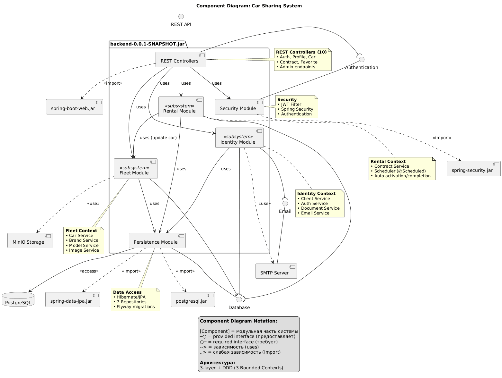
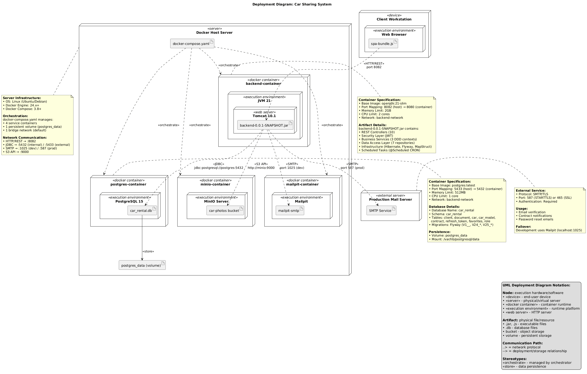
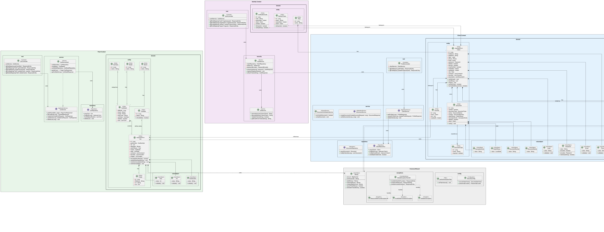
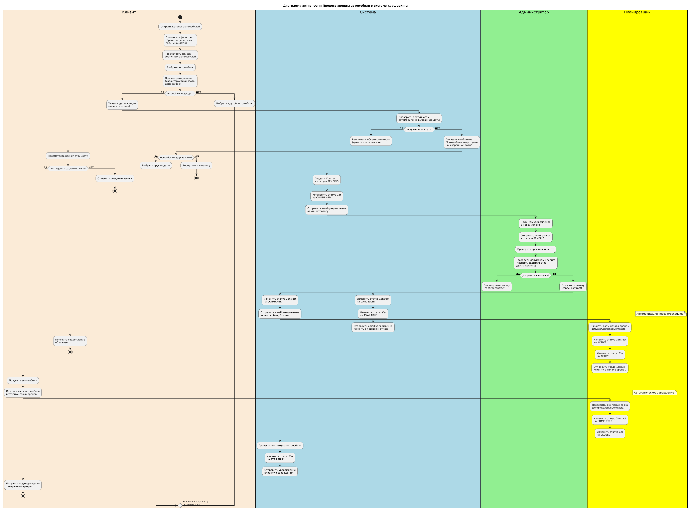
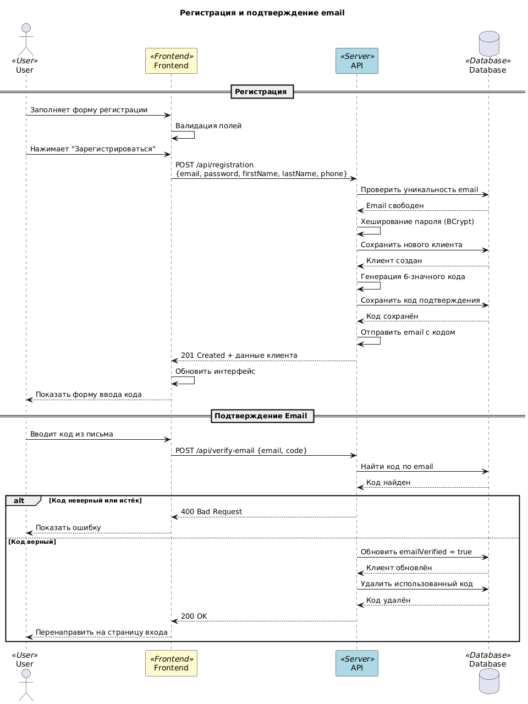
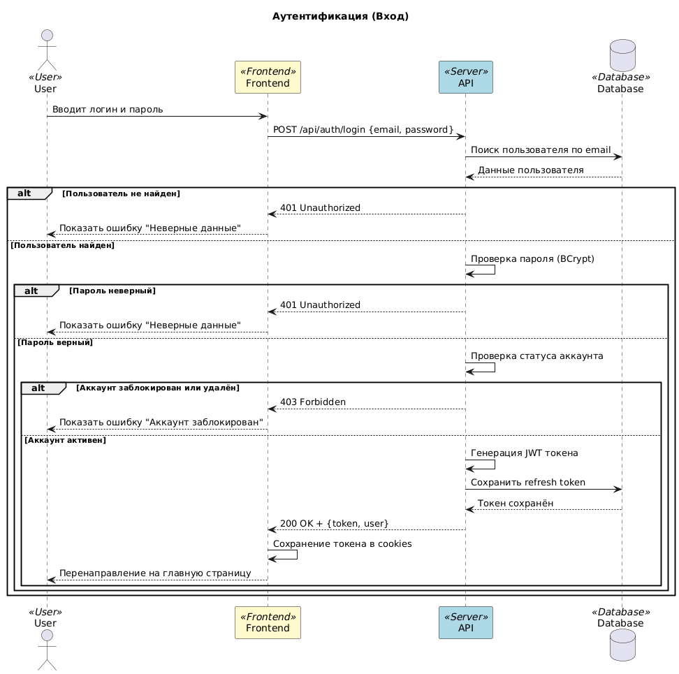
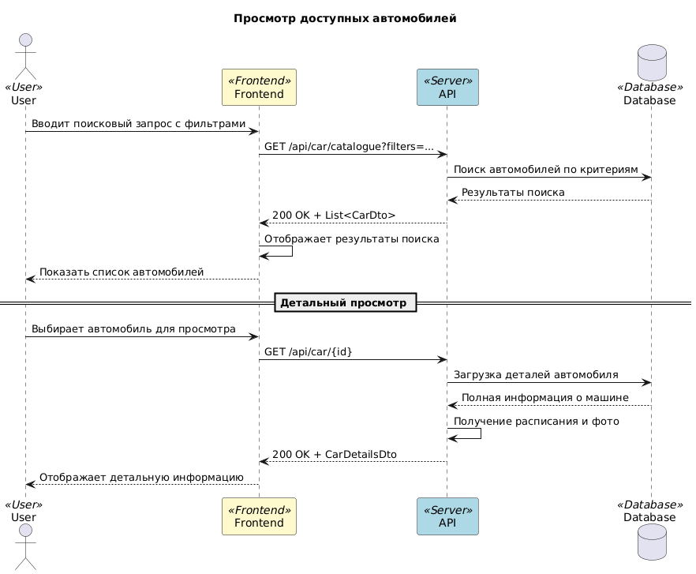
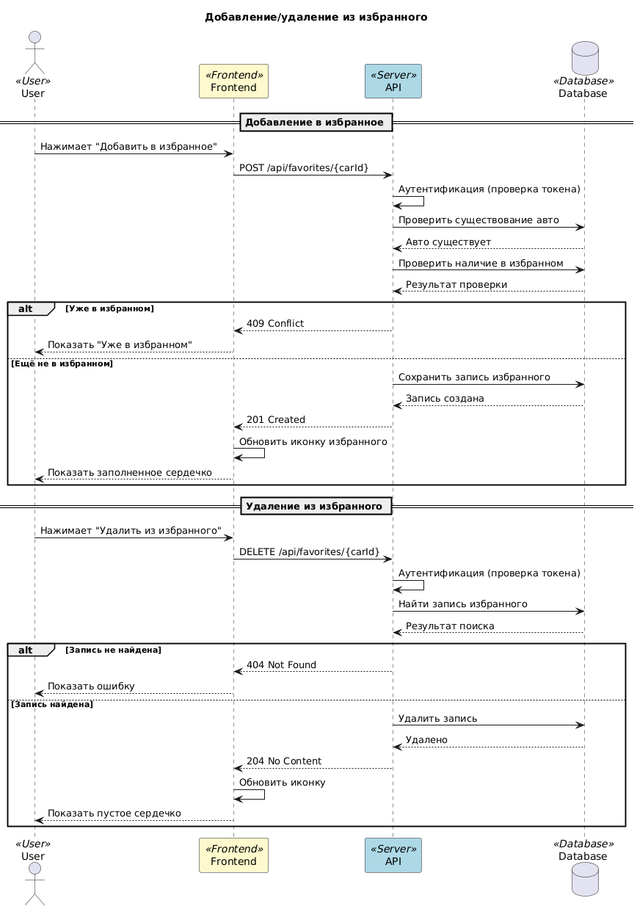
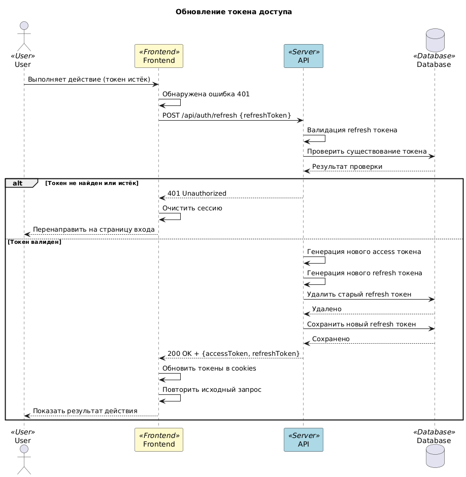

# Car Sharing Backend

<div align="center">

**Backend-сервис информационной системы каршеринга (REST API)**

Проект предназначен для управления пользователями, автопарком и процессом аренды автомобиля: от просмотра доступных авто до оформления и завершения договора.

</div>

---

## Содержание
- [Ключевые особенности](#ключевые-особенности)
- [Архитектура и диаграммы](#архитектура-и-диаграммы)
- [Технологический стек](#технологический-стек)
- [Структура репозитория](#структура-репозитория)
- [Быстрый старт](#быстрый-старт)
- [Локальная разработка (Docker)](#локальная-разработка-docker)
- [Дорожная карта](#дорожная-карта)
- [Документация](#документация)

---

## Ключевые особенности

- REST API для клиентских приложений и административных функций.
- Аутентификация и авторизация (Spring Security, JWT).
- Управление пользователями и подтверждение учетной записи по email.
- Каталог автомобилей с фильтрацией и выдачей детальной информации.
- Договор аренды (создание, статусы, сопровождение процесса).
- «Избранное» для пользователей.
- Миграции схемы БД (Flyway).
- Интеграции:
  - почта (Spring Mail, Mailpit для dev);
  - объектное хранилище для файлов (MinIO — опционально).

---

## Архитектура и диаграммы

Диаграммы являются частью проектной документации и лежат в папке `diagrams/`.

### Диаграмма er

.png)

### Компонентная архитектура



### Диаграмма развертывания



### Диаграмма классов



### Диаграмма активности (бизнес‑процесс аренды)



### Диаграммы последовательностей (ключевые сценарии)

Регистрация и подтверждение email:



Аутентификация:



Просмотр доступных автомобилей:



Создание договора аренды:


Получение деталей автомобиля:


Добавление/удаление из «Избранного»:



Обновление токена:



Дополнительно:
- исходники диаграмм (PlantUML) и правила оформления: `diagrams/README_DIAGRAMS.md`
- контроль соответствия UML: `diagrams/UML_COMPLIANCE_CHECK.md`
- журнал изменений диаграмм: `diagrams/CHANGELOG_DIAGRAMS.md`

---

## Технологический стек

- Язык: Java 21
- Фреймворк: Spring Boot 3.5.x
- Web/API: Spring Web (REST)
- Безопасность: Spring Security, JWT (jjwt)
- Данные: Spring Data JPA, Hibernate
- База данных: PostgreSQL
- Миграции: Flyway
- Документация API: springdoc-openapi (Swagger UI)
- Тестирование: JUnit 5, Spring Boot Test, Testcontainers, JaCoCo
- Инфраструктура: Docker, Docker Compose
- Интеграции: Spring Mail (dev: Mailpit), MinIO (опционально)

---

## Структура репозитория

```
backend/
  diagrams/                    # UML и проектная документация (png/puml/pdf)
  src/
    main/
      java/                    # исходный код
      resources/               # application.yaml, миграции Flyway
    test/
      java/                    # тесты
      resources/               # тестовые настройки/миграции
  docker-compose.yaml          # PostgreSQL (по умолчанию порт 5433)
  docker-compose.dev.yml       # dev‑сервисы (Mailpit)
  docker-compose_miniIo.yml    # опционально MinIO
  pom.xml
  mvnw, mvnw.cmd
  README.md
```

---

## Быстрый старт

Требования:
- JDK 21
- Docker и Docker Compose

1) Поднять инфраструктуру (PostgreSQL + dev‑сервисы при необходимости):

```bash
# PostgreSQL
docker-compose -f docker-compose.yaml up -d

# Mailpit (dev)
docker-compose -f docker-compose.dev.yml up -d
```

2) Собрать и запустить приложение:

```bash
./mvnw clean package
./mvnw spring-boot:run
```

3) Проверить доступность:
- Swagger UI (если включен): `http://localhost:8080/swagger-ui/index.html`

Примечание: конечный порт и базовый путь зависят от значений в `src/main/resources/application.yaml`.

---

## Локальная разработка (Docker)

Окружение разработки разделено на несколько compose‑файлов:
- `docker-compose.yaml` — база данных PostgreSQL (порт 5433 наружу)
- `docker-compose.dev.yml` — Mailpit для перехвата писем (UI: http://localhost:8025)
- `docker-compose_miniIo.yml` — MinIO (если требуется хранение файлов)

Рекомендуемый подход:
- держать инфраструктуру в Docker;
- запускать приложение из IDE (для удобства отладки).

---

## Дорожная карта

- [x] Базовая реализация домена: пользователи/авто/договор/избранное.
- [x] Инфраструктура разработки: Docker Compose, миграции Flyway.
- [x] Набор UML‑диаграмм для ключевых сценариев и архитектуры.
- [ ] Стабилизация контрактов API и унификация ошибок (единый формат ответов).
- [ ] Расширение административного функционала (управление справочниками, модерация данных).
- [ ] Расширение медиа‑подсистемы и интеграции с MinIO (файлы и изображения).
- [ ] Усиление наблюдаемости: метрики/логи/трейсинг, эксплуатационные профили.
- [ ] Повышение покрытия тестами ключевой бизнес‑логики, стабилизация интеграционных тестов.

---

## Документация

- UML и правила оформления: `diagrams/README_DIAGRAMS.md`
- Миграции БД: `src/main/resources/db/migration/`
- Конфигурация: `src/main/resources/application.yaml`
